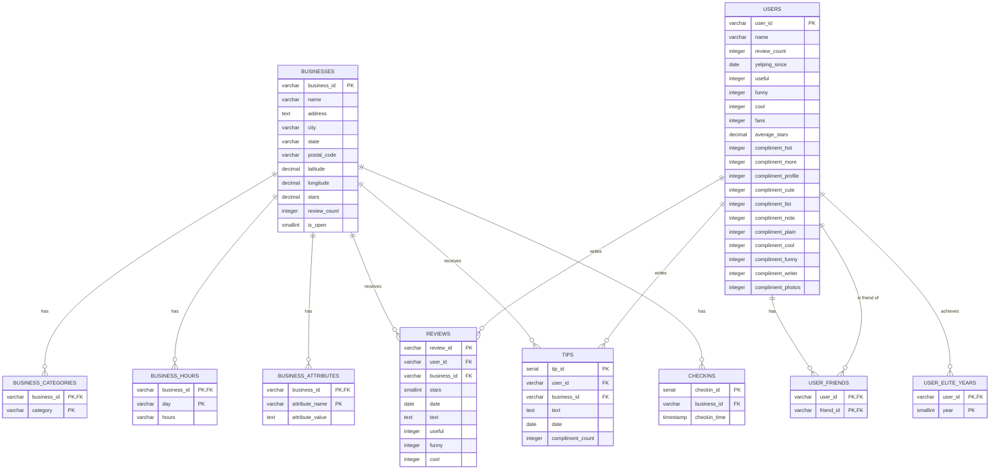

# Yelp Dataset - Entity Relationship Diagram

## Overview
This document describes the entity relationships in the Yelp academic dataset schema.

## ER Diagram (Mermaid)



## Entity Descriptions

### Core Entities

#### 1. BUSINESSES
Central entity representing physical businesses.

**Attributes:**
- Primary location data (address, city, state, coordinates)
- Aggregate metrics (stars, review_count)
- Operational status (is_open)

**Relationships:**
- One-to-many with categories, hours, attributes
- One-to-many with reviews, tips, checkins

#### 2. USERS
Yelp platform users who create content.

**Attributes:**
- Profile information (name, join date)
- Engagement metrics (review_count, fans)
- Community reputation (compliments, elite status)

**Relationships:**
- One-to-many with reviews, tips
- Many-to-many with other users (friendships)
- One-to-many with elite years

### Relationship Tables

#### 3. BUSINESS_CATEGORIES
Normalized many-to-many relationship between businesses and categories.

**Example:** A restaurant can be both "Mexican" and "Burgers"

#### 4. BUSINESS_HOURS
Operating hours for each day of the week.

**Example:** Monday: "10:00-22:00", Tuesday: NULL (closed)

#### 5. BUSINESS_ATTRIBUTES
Flexible key-value store for business properties.

**Examples:**
- "RestaurantsTakeOut": "True"
- "BusinessParking": "{'garage': false, 'street': true}"

#### 6. USER_FRIENDS
Social network graph (undirected edges).

**Note:** Stored as directed edges for query simplicity.

#### 7. USER_ELITE_YEARS
Years when user achieved elite status.

**Example:** User elite in [2012, 2013, 2015]

### Interaction Entities

#### 8. REVIEWS
Full-length reviews with star ratings and vote counts.

**Cardinality:**
- Each review belongs to one user and one business
- Users can have multiple reviews
- Businesses can have many reviews

#### 9. TIPS
Short suggestions or quick advice.

**Difference from Reviews:**
- Shorter text (no star rating)
- Single compliment count (vs. useful/funny/cool)
- More casual/informal

#### 10. CHECKINS
Timestamped check-in events.

**Note:** Original JSON has comma-separated timestamps; we explode into individual rows.

## Cardinality Summary

| Relationship | Type | Notes |
|--------------|------|-------|
| Businesses → Categories | 1:N | One business, many categories |
| Businesses → Hours | 1:7 | One business, up to 7 days |
| Businesses → Attributes | 1:N | Variable attributes per business |
| Businesses → Reviews | 1:N | One business, many reviews |
| Businesses → Tips | 1:N | One business, many tips |
| Businesses → Checkins | 1:N | One business, many timestamps |
| Users → Reviews | 1:N | One user, many reviews |
| Users → Tips | 1:N | One user, many tips |
| Users → Friends | N:M | Many-to-many friendship |
| Users → Elite Years | 1:N | One user, multiple elite years |
| Reviews → Users | N:1 | Many reviews, one user |
| Reviews → Businesses | N:1 | Many reviews, one business |
| Tips → Users | N:1 | Many tips, one user |
| Tips → Businesses | N:1 | Many tips, one business |

## Referential Integrity

### Foreign Key Constraints

All foreign keys use `ON DELETE CASCADE` to maintain consistency:

- Deleting a business removes all associated categories, hours, attributes, reviews, tips, and checkins
- Deleting a user removes all their reviews, tips, friendships, and elite years
- Orphaned records are prevented by the database

### Constraint Checks

- `stars` must be between 0 and 5 (businesses) or 1 and 5 (reviews)
- `is_open` must be 0 or 1
- `day` must be valid day name (Monday-Sunday)
- `user_id != friend_id` (no self-friendships)
- `year` between 2004 and 2030 (reasonable elite year range)

## Normalization Level

### 3NF (Third Normal Form)

The schema adheres to 3NF principles:

1. **1NF:** All attributes are atomic (no multi-valued fields)
   - Categories split from comma-separated list
   - Checkin timestamps exploded into rows
   - Hours separated by day

2. **2NF:** All non-key attributes fully depend on primary key
   - Business attributes depend on (business_id, attribute_name)
   - User friends depend on (user_id, friend_id)

3. **3NF:** No transitive dependencies
   - Review stars don't determine business stars (aggregate)
   - User review_count is denormalized for performance

### Denormalization Decisions

Strategic denormalization for query performance:

| Field | Table | Reason |
|-------|-------|--------|
| `review_count` | businesses | Avoid COUNT(*) aggregation |
| `stars` | businesses | Avoid AVG() aggregation |
| `review_count` | users | Avoid COUNT(*) aggregation |
| `average_stars` | users | Avoid AVG() aggregation |
| Compliment columns | users | Avoid 11 separate tables |

**Trade-off:** Update complexity vs. read performance

## Indexing Strategy

### Primary Indexes (Clustered)
- All tables have primary keys
- Composite keys for junction tables

### Secondary Indexes (Non-Clustered)
- Foreign key columns for join performance
- Frequently filtered columns (city, stars, date)
- Sorting columns (review_count, fans)

See `create_indexes.sql` for full index definitions.

## Query Patterns

### Common Query Types

1. **Location-based search**
   - Find businesses in city/state
   - Filter by category and rating
   - Uses: `idx_businesses_location`, `idx_business_categories_category`

2. **Review analysis**
   - Recent reviews for business
   - User review history
   - Uses: `idx_reviews_business_date`, `idx_reviews_user_id`

3. **Social network**
   - User's friends
   - Friends-of-friends
   - Uses: `idx_user_friends_friend_id`

4. **Temporal analysis**
   - Reviews over time
   - Check-in patterns
   - User cohorts
   - Uses: `idx_reviews_date`, `idx_checkins_business_time`, `idx_users_yelping_since`

5. **Top-K queries**
   - Top-rated businesses
   - Most reviewed users
   - Most popular tips
   - Uses: Index on sort column + LIMIT

### Example Queries

**Q1: Top 10 restaurants in Philadelphia**
```sql
SELECT b.name, b.stars, b.review_count
FROM businesses b
JOIN business_categories bc ON b.business_id = bc.business_id
WHERE b.city = 'Philadelphia'
  AND bc.category = 'Restaurants'
  AND b.is_open = 1
ORDER BY b.stars DESC, b.review_count DESC
LIMIT 10;
```

**Q2: Most active users (by review count)**
```sql
SELECT user_id, name, review_count, fans
FROM users
ORDER BY review_count DESC
LIMIT 100;
```

**Q3: Recent reviews for a business**
```sql
SELECT r.date, r.stars, r.text, u.name
FROM reviews r
JOIN users u ON r.user_id = u.user_id
WHERE r.business_id = 'abc123xyz'
ORDER BY r.date DESC
LIMIT 20;
```

## Future Extensions

### Potential Enhancements

1. **Photo support**
   - Add `photos` table if dataset includes photo.json
   - Link to businesses with foreign key

2. **Geospatial queries**
   - Install PostGIS extension
   - Create GEOGRAPHY column
   - Use ST_Distance for proximity search

3. **Full-text search**
   - Elasticsearch integration for review text
   - Hybrid search (SQL + Elasticsearch)

4. **Time-series optimization**
   - Partition `reviews` table by date
   - TimescaleDB for check-in analysis

5. **Graph database**
   - Neo4j for complex social network queries
   - Friend recommendations
   - Community detection

## References

- Yelp Dataset Documentation: https://www.yelp.com/dataset/documentation/main
- PostgreSQL Documentation: https://www.postgresql.org/docs/
- Database Normalization: https://en.wikipedia.org/wiki/Database_normalization
